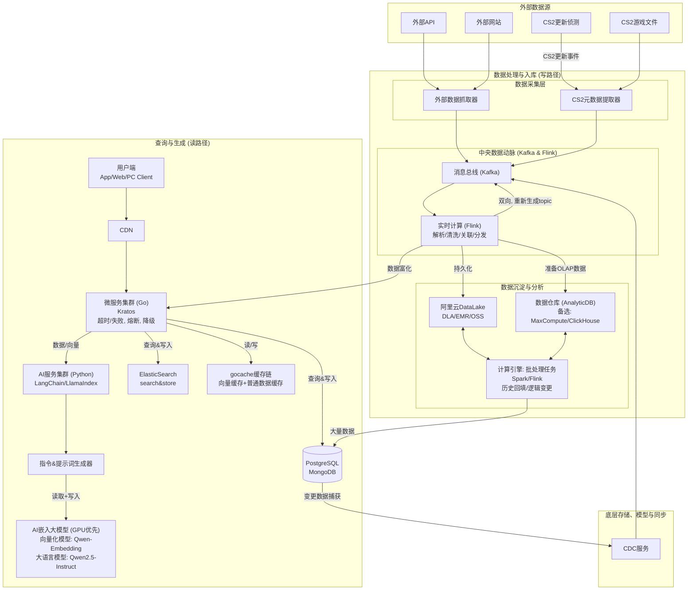

# 雅典娜之盾 (Athena's Shield) 项目：技术架构与设计白皮书

> **文档版本**: 1.0
> **最后更新**: 2025年10月7日
> **核心贡献者**: Junleonger, Oscast

## 1. 项目摘要 (Executive Summary)

“雅典娜之盾”是一个面向未来的、数据驱动的智能问答与分析系统。项目旨在构建一个能够持续学习、自我演进的知识中枢，通过整合先进的实时数据处理技术与大语言模型（LLM）的生成能力，为用户提供精准、实时、有深度的答案。

本系统架构的核心特点是**读写分离**与**智能协同**：
*   **写路径 (Data Ingestion & Processing)**: 一条基于事件驱动的、高吞吐量的实时数据处理流水线，负责从多源异构数据中感知变化、清洗、丰富并沉淀知识。
*   **读路径 (Query & Generation)**: 一条基于检索增强生成（RAG）模式的智能查询链路，负责理解用户意图，从海量知识库中精准检索相关信息，并由大语言模型生成高质量的自然语言答案。

本文档将详细阐述其总体架构、核心技术栈、关键设计模式以及实现该蓝图的实验性项目 `OSC-YALAB`。

---

## 2. 核心设计哲学 (Core Design Philosophy)

“雅典娜之盾”的设计遵循以下核心原则：

1. **职责分离 (Separation of Concerns)**: 严格划分业务编排（Go）、数据处理（Flink/Kafka）和 AI 计算（Python）的职责边界，使各组件可以独立演进和扩展。
2. **事件驱动 (Event-Driven)**: 系统内部的关键通信通过消息队列（Kafka）以异步事件的方式进行，实现组件间的松耦合和高弹性。
3. **数据为中心 (Data-Centric)**: 所有决策和智能都围绕着一个统一、干净、可信的数据基座展开。数据的实时性、一致性和丰富性是系统的生命线。
4. **弹性与可观测性 (Resilience & Observability)**: 在关键服务节点（如 Go 微服务集群）内置熔断、降级、超时等高可用策略，并确保所有核心流程都具备良好的日志和监控能力。
5.  **AI 赋能 (AI-Empowered)**: 将大语言模型（LLM）作为系统的“智慧大脑”，但通过 RAG 架构进行约束和增强，确保其输出的准确性和时效性，有效抑制“模型幻觉”。

---

## 3. 系统总体架构 (System Overview Architecture)

系统的整体蓝图由数据处理（写路径）和查询生成（读路径）两大生命线构成，它们通过共享的底层数据存储与消息总线进行交互。

## 4. 架构深度解析 (Architectural Deep Dive)

### 4.1. 写路径：实时数据工厂
写路径的目标是将外部世界的原始信息转化为系统可理解的、结构化的知识。

1. **多源采集**: 外部数据抓取器 和 CS2元数据提取器 并行工作，分别从 Web API、网站页面、游戏文件等多种来源获取原始数据。
2. **事件发布**: 所有采集到的原始数据或变更事件，都被统一格式化后发布到 Kafka 消息总线。Kafka 在此作为系统的数据动脉，起到了削峰填谷和解耦上下游的作用。
3. **实时处理**: Flink 作业作为核心流处理引擎，订阅 Kafka 中的原始事件。它负责进行实时的解析、清洗、数据关联（例如，与数据库中的现有数据进行关联丰富）和分发。
4. **数据同步与持久化**: Flink 处理后的干净数据，一部分会持久化到 阿里云DataLake (OSS) 作为原始数据的黄金副本。另一部分用于分析的数据则被送入 数据仓库 (AnalyticDB) 以支持 OLAP 查询。同时，Flink 也可以将处理结果重新发布回 Kafka 的新 Topic，供其他服务（如 微服务集群）消费，实现“数据富化”。变更数据捕获 (CDC): CDC服务 (如 Debezium) 监控核心业务数据库 PostgreSQL 的变更，并将这些变更事件实时推送到 Kafka。这打通了业务系统与数据系统之间的壁垒，使得对业务数据的任何修改都能被数据工厂感知到。
5. **批处理能力**: 计算引擎 (Spark/Flink) 与数据湖/仓配合，提供离线的、大规模的批处理能力，用于历史数据回填、模型重新训练、批量逻辑订正等复杂任务。

### 4.2. 读路径：RAG 智能查询引擎
读路径是系统智能的直接体现，它通过一套精密的 RAG 流程来响应用户查询。

1. **入口与调度**: 用户通过客户端访问系统，请求首先到达 微服务集群 (Go)。这个基于 Kratos 的集群是整个读路径的总指挥官，负责流程编排、高可用保障（熔断、降级）和多级缓存（gocache）。
2. 意图理解与向量检索 (第一轮调用):
Go 服务接收到用户问题后，调用 AI服务集群 (Python) 的第一个接口。  
Python 服务使用 Qwen-Embedding 模型将用户问题转换为向量，然后向 ElasticSearch 发起向量相似度搜索，找出最相关的 Top-K 个知识片段的 ID。  
Python 服务将这些 ID 列表返回给 Go 服务。  
3. 上下文组装: Go 服务拿到 ID 列表后，并行地从 gocache缓存链 或 PostgreSQL 数据库中获取这些 ID 对应的完整、最新的文本内容。然后，它将这些文本内容按照预设格式组装成一个完整的“上下文 (Context)”。
4. 生成答案 (第二轮调用):
Go 服务再次调用 AI服务集群 (Python) 的第二个接口，这次传递的参数是 原始问题 和 组装好的上下文。  
Python 服务内部的 指令&提示词生成器 将问题和上下文包装成一个高质量的 Prompt。  
该 Prompt 被发送给 Qwen2.5-Instruct 大语言模型。  
结果返回: LLM 生成最终答案，经由 Python 服务返回给 Go 服务，最终呈现给用户。  

## 5. 核心技术栈 (Core Technology Stack)

### 5.1. 微服务与数据处理
类别	技术/库	版本/说明  
微服务框架	Kratos (github.com/go-kratos/kratos/v2)	Go 服务骨架，提供 gRPC & HTTP  
数据库	PostgreSQL	主持久化存储  
缓存	gocache (L1:Ristretto, L2:Memcached)	多级缓存抽象  
消息队列	Apache Kafka	异步事件总线  
实时数据捕获	Debezium	实现对 PostgreSQL 的 CDC  
流处理引擎	Apache Flink	消费和处理 Kafka 数据流  
### 5.2. AI 与搜索
类别	技术/库	版本/说明
搜索引擎	ElasticSearch	全文搜索与向量检索  
AI 服务运行时	Python (>= 3.10)	运行 AI 模型和 RAG 逻辑  
AI 框架	LangChain / LlamaIndex / DSPy	(待定) 用于指令与提示词工程  
向量化模型	Qwen-Embedding	将文本转换为向量  
大语言模型	Qwen2.5-7B-Instruct	根据上下文生成答案

## 6. 附录：OSC-YALAB 实验项目
为了验证“雅典娜之盾”架构的可行性，我们创建了 OSC-YALAB (Open Source Concepts - Yet Another LABoratory) 项目。这是一个纯粹的、实验性的后端项目，其目标是：

熟练掌握 AI 辅助开发工作流 (如 VSCode Copilot)。  
用最简单的示例来验证上述技术栈，包括 Kratos、CDC、Flink 和 RAG 架构的整合。  
OSC-YALAB 项目是“雅典娜之盾”蓝图的最小可行实现 (MVP)，它将理论设计付诸实践，为项目的最终成功奠定坚实的技术和工程基础。  